1. ##### 计算机性能指标

   1. 字长：CPU和内存之间的传输单位，处理8位字长的就是8位CPU，以此类推。
   2. 主频率：CPU单位时间内的平均执行次数，以兆赫兹为单位，频率越高，计算机的运算速度越快
   3. 存储容量
   4. 存储速度
   5. 可靠性：平均无故障工作时间

2. #### 操作系统的主要功能

   1. 处理器管理：进程控制、调度、通信
   2. 存储器管理：内存管理
   3. 设备管理：简单说就是CPU的高速和IO的低速之间的矛盾性，要做缓存，控制IO
   4. 文件管理
   5. 用户接口：提供各种系统调用

3. #### 计算机病毒的特点

   1. 自我复制
   2. 潜伏性
   3. 破坏性
   4. 变异性：自适应改变代码，逃避杀毒软件检测
   5. 针对性

4. #### 打印机的分类

   1. 喷墨打印机
   2. 激光打印机：用静电技术把粉墨粘到纸上
   3. 点阵打印机：用打印机上的小针脚敲击纸
   4. 热敏打印机：用热敏纸和热敏头打印
   5. 3D打印机

5. #### 操作系统的种类

   1. 分时：把处理器的性能按时间片分配，让每个用户都感知自己独占资源，比如unix
   2. 批处理：用户可以将一系列的作业以批量方式提交给系统执行。系统会按照作业的顺序自动执行它们，用户无需手动干预
   3. 实时：需要及时响应，任务调度很严格，例如航天工作

6. #### 计算机表示指令和数据编码采用的进制是二进制，16进制只是方便阅读

7. #### 进程通信

   1. 管道：用法不说了，本质就是内存里的一小段缓存，不适合大量数据或者频繁的调用，只适合简单的场景，好用
   2. 消息队列：内核的消息链表，由于是链表，通信是有延迟的
   3. 共享内存

8. #### 死锁的条件

   1. 互斥
   2. 请求和保持：手里有一个，再去求一个
   3. 不可剥夺
   4. 循环等待

9. #### 死锁预防

   1. 破坏请求和保持，运行之前一次申请所有需要的资源
   2. 破坏不可剥夺，新申请的资源获得不到，释放自己的资源
   3. 破坏循环等待：所有资源排序，从小到大排，每次也只有从小到大申请

10. #### 计算机机系统的表现

    1. 硬件
       1. CPU
       2. 内存
       3. 硬盘
       4. 主板 提供电源 插槽
       5. 显卡 图像渲染
       6. 电源
    2. 软件：OS、应用软件

11. #### Cookie和Session

    1. 解决的问题：http是无状态的，两次链接之间没有任何相关，有问题
    2. cookie：前后两次http无法得知是不是一个用户，那就给用户一个string做凭证，用户拿这个string去访问，服务端就知道是谁了。但是，cookie只能识别出一些基本操作，例如登录之类的，cookie只能存很少量的数据，浏览器规定的，而且用户可以删除或者禁用cookie。
    3. session：服务器会创建一个sessionId，存在cookie中，也就是这个cookie只要存sessionId就够了，其余的信息放在服务器端存储。当然，服务器也会有压力，尤其是分布式需要额外的分布式session。

12. 现代OS的两个特征是

    1. 程序的并发性
    2. 资源共享性

13. 用户使用计算机的方式：命令行、系统调用

14. 软件危机有什么表现？

    1. 对软件开发成本和进度的估计常常不准（开发进度混乱）
    2. 软件成本占整个系统成本的比例上升（花钱很多）
    3. 没有文档（后来者没法维护）
    4. 质量不行，测试不过
    5. 用户不满意已经完成的内容

15. #### 六大设计原则

    1. 单一职责

       一个类应该只负责一个职责

    2. 开闭原则

       一个类一旦开发完成，后续增加新的功能就不应该通过修改这个类来完成，而是通过继承，增加新的类。

       上来有需求直接改这个类，其实不太好的，但实际上没人屌他。

    3. 里氏替换

       继承的时候不要重写父类方法

    4. 依赖倒置原则

       传统都是高层依赖抽象层，抽象层依赖底层。现在改成高层依赖抽象，底层也依赖抽象，面向接口编程。

    5. 接口隔离原则

       接口尽量粒度更小，例如女性接口，就比较大，可以拆分为人类接口和女性专属特性接口

    6. 迪米特

       最少知识原则，一个类对自己调用的类不需要有感知，再复杂也和我无关。

16. BIOS直接嵌入在主板的ROM里

17. 无损压缩：香农 霍夫曼 游程 LZW 算数

18. 光电鼠标没有机械特性

19. PC主板里的闪存就是用来存BIOS，BIOS就是basic input output system

20. 中继器可以放大信号，延长信号传输距离

21. #### 中断的网络攻击目标是可用性

    1. 修改是完整性
    2. 截获是保密性
    3. 伪造是真实性

22. DRAM是用电容存储信息，周期刷新

23. SRAM是用晶体管存储的，用于高速缓存

24. #### 5G移动的特点和应用场景

    1. 超高的数据传输速率，运用于xx

    2. 超低的功耗，万物互联

    3. 超低的延时，手术

25. #### 软件测试有哪些

    1. 单元测试，程序模块校验，软件详细设计的时候搞

    2. 集成测试，整合单元测试，软件概要设计搞

    3. 系统测试，硬件软件网络，系统分析阶段

    4. 确认测试，确认是否符合用户预期，需求分析完成

26. #### 服务器集群 - 星型结构 - 好处是：

    1. 配置简单，有集中处理的点，可以重新配置

    2. 故障隔离，一台坏了不回应其他

    3. 集中控制：

27. #### 通信子网是通信的。资源子网有web服务器，服务器，终端用户

28. #### 身份认证技术和公钥认证技术

    1. 身份认证是证实对象的身份的
       1. 口令、验证码

       2. IC卡

       3. 生理特征 指纹 虹膜等

    2. 公钥认证技术
       1. 加密技术 CA证书 数字签名，特点是安全性好 具备唯一性

29. #### SSL+HTTP = HTTPS

    1. 先三次握手
    2. TLS四次握手
       1. C告诉S自己支持什么加密版本，比如TLS1.2，使用什么加密算法，比如RSA，以及随机一个R1

       2. S告诉C，加密版本、加密算法、R2，以及对应的一个服务器证书

       3. C从证书里取服务器公钥，生成R3，R1 R2 R3生成一个会话秘钥，同时把当前所有通信内容生成一个摘要，用公钥加密

       4. S使用自己的私钥解密，获得R1 R2 R3获得一个会话秘钥，同时也把把当前所有通信内容生成一个摘要，用公钥加密

    3. 双方获得会话秘钥，开始对称加密

30. #### 数字图像的获取

    1. 扫描 获得阵点
    2. 分色 RGB
    3. 取样 获得亮度 灰度值
    4. 量化 用数字表示

31. 网闸是唯一的物理隔离设备

32. 单模光纤适用于长距离传输 多模适用于短距离传输

33. #### 软件开发的几种模型

    1. 瀑布：阶段固定，A  B  C  D。。。
    2. 螺旋：一个螺旋代表一个周期，适用于那些需求不明的项目
    3. 原型模型：做个demo，完善demo。提供一个快速验证和演示的工具，以帮助团队和利益相关者更好地理解和优化系统需求和设计。
    4. 演变：做个初版，根据用户需求不断迭代

    比如现在二次开发，技术要更新，那还是用瀑布，因为其他模块都搞定了

34. #### IAAS、PAAS、SAAS和LAAS

    1. 基础设施即服务（Infrastructure as a Service，IAAS）：它为用户提供了虚拟化的计算资源，如虚拟机、存储和网络。
    2. 平台即服务（Platform as a Service，PAAS）：它提供了一个完整的应用程序开发和部署环境，包括操作系统、开发工具、数据库和应用程序运行时环境。
    3. 软件即服务（Software as a Service，SAAS）：SAAS是一种提供完整应用程序的服务模型。

35. ##### 数字证书是什么？

    1. 自己在服务器上生成一对公钥和私钥，把域名 申请人 公钥整合为csr文件，发给CA机构
    2. CA机构，会验证这个域名的合法性，验证通过，生成摘要，用CA自己的私钥加密，摘要变为签名
       1. 所谓证书，就是CA的签名+csr明文
       2. 拿到证书的人，用CA的公钥解密即可验证这个信息是否是真实的

36. #### 解释性语言和编译语言

    1. 解释：扫描到一行，执行一行，翻译成机器码一行
    2. 编译：通过编译器一次性把源代码翻译成机器码

37. 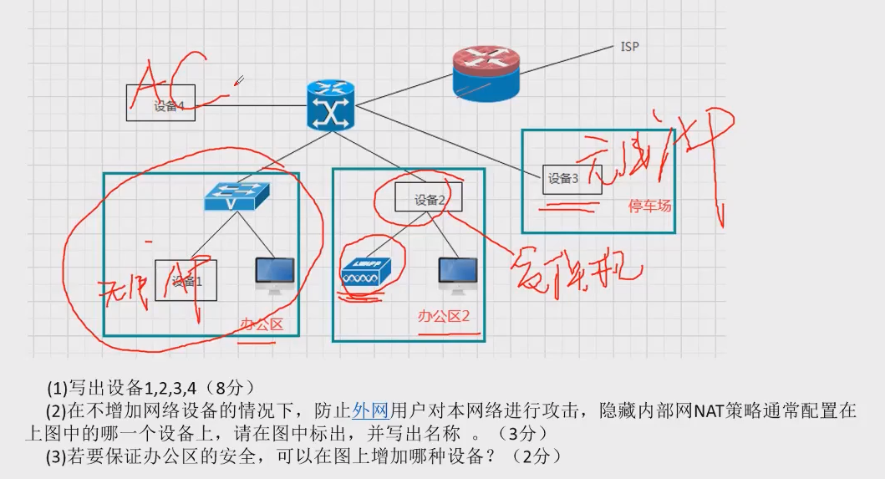

    1. 无线AP就是大型WIFI，范围几公里，AC就是管理AP的，无线设备都可以说是无限AP
    2. NAT直接配在核心路由器上
    3. 防火墙、堡垒主机、IDS 随便写

38. 设备

    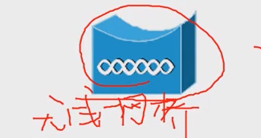

    无线网桥

    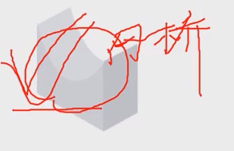

    网桥/无线网桥

    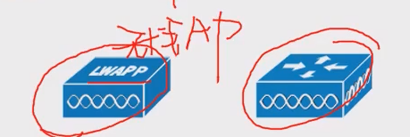

    无限AP

    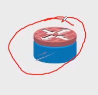

    过滤路由器，带防火墙的

    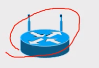

    无线路由器

    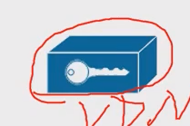

    客户端VPN

    

    

    交换机

    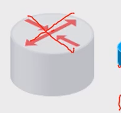

    路由器

    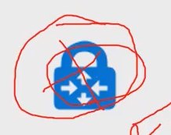

    VPN，有锁有钥匙的都是VPN

    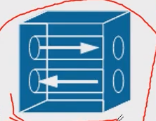

    隧道！VPN通过隧道访问。

39. #### 怎么给电脑配IP？

    1. 网路链接
    2. 属性
    3. TCP/IP协议
    4. 配置内容
       1. IP
       2. 子网掩码
       3. 默认网关
       4. DNS：有地址选地址，也可以选自动获取

40. 屏蔽子网

    1. 定义：在内部和网络之间建立一个被隔离的子网，由四个组成：周边网络 周边路由器 内部路由器 堡垒主机
    2. 除了屏蔽子网，还有什么安全策略？
       1. 物理安全策略 防火墙 网关
       2. 秘钥安全策略 信息加密
       3. 杀毒软件 
       4. IDS IPS
       5. VPN策略（VPN就是通过公共网络建立安全链接的东西，通过加密和隧道，提供远程访问功能）

41. 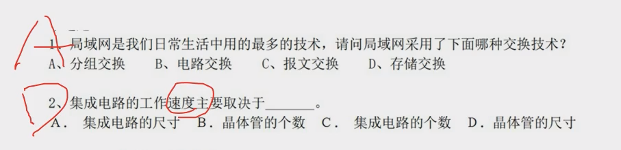

42. 无线局域网组成和优点

    1. 无线网卡
    
43. 显卡连主机的接口有哪些

    1. PCI 
    2. AGP

44. 显卡链接显示器的接口

    1. HDMI
    2. DVI

45. CPU有什么因素影响运行速度？

    1. 主频：CPU的时钟频率，一次时钟内能计算的个数
    2. 指令系统，例如GPU、CISC RISC等等
    3. CPU字长 
    4. CPU缓存
    5. CPU核的个数
    6. 制程技术：同面积晶体管越多越吊

46. IDS intrusion detection system：异常检测，审计、警告等

47. IPS Intrusion Prevention System：阻止入侵

48. 堡垒主机也叫跳板机，进内网必须要登记，提供身份验证和安全访问的功能

49. DHCP的功能？

    1. 保障动态IP的唯一性，只有使用的DHCP才能保证IP不冲突

50. SRAM比DRAM更快 是放在高速缓存里的

51. DMZ是什么？公司内网外有一个防火墙，但是公司也有服务器，别人访问你的首页，肯定要进你的内网，通过你的防火墙，你想把内网和这些服务隔离开

52. windows中的文件系统

   53. NTFS CDFS FAT

54. linux文件系统

    1. ext

55. CDN好处：加快网路速度，因为通过算法让物理距离缩短了，安全方面也有好处，IP被隐藏。

56. WAF是web application firewall，阻断常见的web攻击，比如sql注入、xss等等，拦截恶意流量，认证等等，放在web服务器区域的防火墙

57. DDOS防范：

    1. 流量检测
    2. 增加带宽
    3. 负载均衡
    4. IP过滤
    5. CDN
    6. 防火墙

58. 未来网络安全的应用方向

    1. 大数据安全
    2. 区块链安全
    3. 芯片安全
    4. AI网络安全

59. 选择和快排、堆、希尔是不稳定的排序

60. TIFF是遥感地图文件、BMP是windows绘图的

61. 数据备份

    1. 数据转储：定期拷贝磁盘
    2. 磁盘镜像：两个磁盘同时放在一个阵列卡上，要写两个一起写
    3. 双机互备：主从
    4. 双机双工：多个pod
    5. 双机冷备：两台机器，定期通信

62. 怎么扩大wifi网速

    1. 买高功率路由器
    2. 买无限拓展器，小型区域使用，哪里网不好放哪里
    3. 再买一台路由器，桥接，成本比较大
    4. 使用AC AP，适合大面积区域

63. VPN和暴雷主机区别

    1. vpn是为了远程访问
    2. 暴雷是为了审计，控制人员权限

64. 外部访问内部，除了VPN 堡垒 还有端口转发，防火墙设置一个专门访问的端口

65. 网速变慢的原因：

    1. 
    2. 

