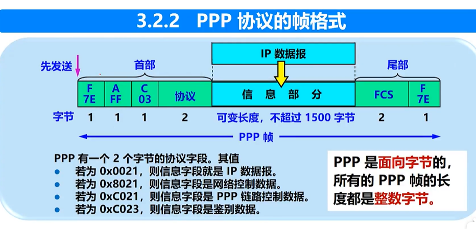

#### 概述

五层协议

1. 应用层：直接为用户进程提供服务
2. 传输层：给两个进程之间提供运输服务的
   1. tcp transmission control protocol，面向连接，传输单位是报文段
   2. udp user datagram protocal，单位是用户数据报
3. 网络层：数据从源节点到目标节点，网络和网络之间的传播。比如路由器，路由器是在ip地址之间进行传输的。
4. 数据链路:比特流划分成**数据帧**。比如交换机，交换机是在mac地址之间进行传输的。
5. 物理层：比特流传输。比如集线器，它不对数据包做处理，所以是物理层。

#### 物理层

1. 可以把物理层的主要任务说成传输媒体的接口有关系的一些特性
   1. 机械特性：接口用的接线器的形状、尺寸、引脚数目（就是芯片的接口）
   2. 电气特征：接口电缆的各条线上的电压范围
   3. 功能特性：某条线上的某个电平的意义
   4. 过程特性：定义了各个信号线的工作顺序和时序，保证比特率能传输
2. 从通信双方的交互形式来看，有三种：
   1. 单向通信，例如无线电广播、电视广播
   2. 半双工，双向，但是同时只能一方在发
   3. 全双工
3. 传输媒体两类：
   1. 导向传输媒体（电缆）
      1. 双绞线：家庭、办公的短距离传输
      2. 同轴电缆：有线电视、宽带等长距离
      3. 光缆：最屌
   2. 非导向传输媒体（无线电）
4. 频率和波长
   1. 频率是单位时间周期重复次数
   2. 波长是一个周期能跑多远
   3. 速度 = 频率*波长，也就是单位时间能跑多远！
5. 微波是高频率短波长，所以穿透能力比较强，所以能穿透大气层在地球表面传播，被广泛应用于卫星、无线、移动网络等等
   1. 微波是直线
   2. 微波通信大致分为两种：
      1. 地面微波接力通信
      2. 卫星
6. xDSL（Digital Subscriber Line）是一组用于在标准电话线（铜线）上提供高速数字通信的技术。它是一种宽带接入技术，可以提供高速的互联网连接。
7. 多路复用：多个独立信号源绑定在一条传输线上，发送方把多个输入信号合并，形成一个复合信号，通过传输媒介发送给接收端，接收端分离出原始信息，恢复成独立的数据流。
   1. 频分复用：用频率进行隔离，比如电视广播、有线电视，多个频道同时传输
   2. 时分复用：每个用户周期性工作，比如电话（不太理解）
   3. 码分复用：使用不同的编码序列隔离，无线通信等等

#### 数据链路（交换机）

1. 链路和数据链路的区别

   1. 链路是一条单纯的物理线段
   2. 数据链路是把控制传输协议的硬件和软件加到链路上，比如网卡

2. 数据链路层的信号主要有两种

   1. 点对点
   2. 广播

3. 网络层传下来的是IP数据报，数据链路成把这些数据报构成帧。

4. 点对点的数据链路层通信协议（从上往下）：

   1. IP数据报添加首部和尾部封装成帧
   2. 发送到另一个节点
   3. 另一个节点确认无差错，否则丢弃，不然提取IP数据报传给网络层

5. 数据链路层协议很多，但有三个共同的问题/特性

   1. 封装成帧

      1. 帧长度 = IP数据报长度+帧的首部尾部
      2. 首部SOH和尾部EOT最重要的作用就是确定帧的界限

   2. 透明传输

      1. 字节填充：发送端的内容里要是有SOH或者EOT，就在前面填充一个ESC。如果要发ESC，那ESC自己前面也要填充一个ESC。

   3. 差错控制

      1. 比特差错

         循环冗余检验CRC，原始数据是k位，后面再加n位CRC冗余码，一共发k+n位数据。检测方法就是，两边提前定好，用前n位生成一个p，前k位数据模p的余数就是那n位冗余码。后面那个n，说的高大上一点就是帧检验序列。**CRC仅仅是保证无比特差错！**

      2. 传输差错

         帧丢失、重复、乱序。要可靠的话，还要加入编号、重传等机制。

6. PPP协议

   上门装宽带，给你一个用户名和密码，路由器通过这个账号，拨号上网，这个时候就是PPP协议。

   

​	PPP在异步传输的时候是用字节填充法，同步传输用零比特填充。

