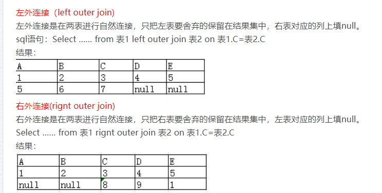
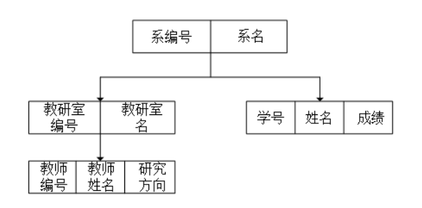
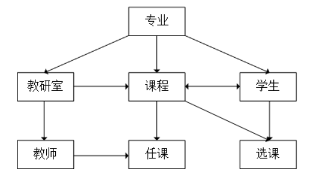

1. 数据库系统有独立性的特点，数据和程序隔离

2. 关系= 数据库表

3. 元组= 一行数据

4. 属性名 = 列名

5. 元组个数 = 关系基数

6. 属性个数 = 关系度或者目数

7. 属性的定义范围 = 域

8. 候选键 = 很多可以设为主键的列，有唯一性

9. 实体型 = 表结构

10. 实体值 = 表里数据

11. 实体集 = 表里一行行的数据

12. 实体标识符 = 主键

13. 实体是矩形，属性是椭圆，棱形是关系

14. 主键是最小的**超键**，超键就是包含主键的任意组合

15. DML是普通操作，DDL是定义

16. 存储模式就是分区、索引这些

17. 模式名词

    1. 内模式 -> B+树等具体存储
    2. 外模式就是用户看的视图，对应DML
    3. 概念模式对应DDL
    4. 分片模式就是sharding
    5. 分配模式就是根据数据选策略

    

    比如选择题：**当数据库的存储结构改变了，DBA对模式和内模式映射做出相应改变，可以使模式不变，从而保证物理独立性。**

18. 连接

    

    1. 笛卡尔

       

    2. 等值连接：把同样的列重合列，里面相等值的留下来

       

    3. 自然连接：等值连接的重复列给取了

    4. 内连接：等值连接是同样的列，它可以自己指定列

       

    5. 外连接

       1. 外连接不加条件就是笛卡尔积

          

       2. 全外连接就是把自然连接里面等值以外的也保留进来！

          

       3. 左连接和右链接就是对应null的不要了

          

19. 外键使用，后面要加reference

    ```sql
    FOREIGN KEY (外键列) REFERENCES 主表(主键列)
    ```

20. 范式

    1. 第一范式

       1. 列要最细粒度，列要最细粒度 2. 每个字段的值都是单一值。
       2. 比如电话可以分为办公电话和移动电话，就不符合，比如数量这个字段不能是范围，必须是单一的值
       3. 作用是消除重复列
       4. 解决方案加个id就行

    2. 第二范式

       1. 先说什么是依赖
          1. 完全函数依赖：{a ,b, c} -> d，abc少了一个都没法推出d
          2. 部分函数依赖：{a , b, c } - > d，并且b也能推到 d （所以第二范式 消除了非主属性对码的部分函数依赖，假设d是唯一逐渐，那光靠abc的真子集都没法推出d，必须把abc全搭上了，才能推出d）
       2. 非主键的字段只能依赖候选键，不能相互依赖
       3. 比如学生和课程，通过成绩表，多对多，强行塞到一张表，那课程和成绩会相互依赖

    3. 第三范式：非主键字段不能依赖非主键字段，比如学生表里有系别和系电话，要拆表，不然数据冗余

    4. BCNF（第三范式加强版）：关键字段不能相互依赖

    5. 第四范式：非主属性相互独立，这些非主属性不能有多值。比如用户是主键，手机和电话是非主属性，一个用户有一个手机一个电话，用户就要写两行。应该把表规范为用户-号码-类型

       > 1NF： 字段是最小的的单元不可再分 
       >
       > 2NF：满足1NF,表中的字段必须完全依赖于全部主键而非部分主键 (一般我们都会做到) 
       >
       > 3NF：满足2NF,非主键外的所有字段必须互不依赖
       >
       > 4NF：满足3NF,消除表中的多值依赖

       

21. 区分一个系统是分散式还是分布式的方法： 就是判断系统是否支持全局应用。所谓全局应用，就是指涉及到两个或两个以上场地中数据库的应用。

22. 分布式数据库系统的透明性： 

    1.  位置透明性：是指用户和应用程序不必知道它所使用的数据在什么场地。 
    2.  复制透明性：在分布式系统中，为了提高系统的性能和实用性，有些数据并不只存放在一个场地，很可能同时重复地存放在不同的场地。

23. 分布式数据库系统的分类：

    1.  同构同质型DDBS ：多个节点 数据类型相同，软硬件配置和DBMS都一样
    2.  同构异质型DDBS ： 多个节点 数据类型相同，软硬件配置和DBMS都不同样
    3.  异构型DDBS：啥也不同

24. 数据分配： 数据分配是指数据在计算机网络各场地上的分配策略

    1. 集中式：所有数据均安排在同一场地
    2. 分割式：所有数据分成n个，分别被安置在n个场地
    3. 全复制式：数据在每个场地重复存储
    4. 混合式

25. 数据分片：

    1. 水平分片：按行为单位
    2. 垂直分片：按列为单位
    3. 混合

26. 分片视图：拆数据 && 分配视图：数据分到不同节点

27. 分布透明性： 用户不必关心数据的逻辑分片，不必关心数据物理位置分配的细节，也不必关心各个场地上数据库的数据模型。它可归入物理独立性的范围

    1. 分片透明性：用户或应用程序只对全局关系进行操作而不必考虑数据的分片（直接用，什么都别管）
    2. 位置透明性：**分片和分配视图之间**。用户或应用程序应当了解分片情况，但不必了解片段的存储场地（用分片，别管场地）
    3. 局部数据模型透明性：**位于分配视图与局部概念视图之间**，指用户或应用程序要了解分片及各片段存储场地，但不必了解局部场地上使用的是何种数据模型。（用分片以及场地，但是不要知道什么类型的数据）

28. 分布式系统的透明性主要表现在

    1. 位置透明：不用管存哪里、怎么划分

    2. 复制透明：冗余数据怎么保持一致性，你也不用管

29. DDBMS主要功能

    1. 接收用户请求，并判定把它送到哪里
    2. 访问网络数据字典，或者至少了解如何请求和使用其中的信息
    3. 如果目标数据存储于系统的多个计算机上，就必须进行分布式处理
    4. 通信接口功能。在用户、局部DBMS和其它计算机的DBMS之间进行协调
    5. 一个异构型分布式处理环境中，还需提供数据和进程移植的支持。（数据移植就是不同数据切换、进程移植就是不同OS切换）   

30. 分布式数据库系统中存在的问题

    1. 不同场地的通信速度，与局部DBS的存储部件的存取速度相比，是非常慢的
    2. 通信系统有较高的存取延迟时间
    3. 在CPU上处理通信的代价很高（浪费CPU资源）
    4. 不同通信系统有不同意义的字符（编码转换）

31. 在客户/服务器式DBS中，数据库应用的功能分成哪两部分

    1. 前端部分：实现前端处理和用户界面
    2. 后端部分：包括存取结构、查询优化、并发控制、恢复等系统程序，完成事务处理和数据访问控制。

32. 在典型的分布式DBMS中，把软件模块划分成哪三个级别

    1. 服务器级软件
    2. 客户机级软件 
    3. 通信软件

33. 无损连接：inner join加个条件，学生表有三个数据，课程表有三个数据，结果还是三个，没有重复和冗余

34. 判断无损连接和保持分解：

    1. 保持FD的分解一眼就能从题目中看出，只要看FD 左右的两个属性是否分别在两个Ri中，若在同一个Ri中则保持 FD，反之，FD丢失。
    2. https://www.bilibili.com/video/BV1DR4y1G7FV/?spm_id_from=333.337.search-card.all.click&vd_source=1a9269c8954959ac9b1d267e312855a7

35. 关系代数（就是tm的sql）的五个基本操作

    1. 投影
    2. 选择
    3. 并
    4. 差
    5. 笛卡尔积

36. 实体完整性这项规则**要求每个数据表都必须有主键，而作为主键的所有字段，其属性必须是独一及非空值**

37. 参照完整性规则是指**要求通过定义的外关键字和主关键字之间的引用规则来约束两个关系之间的联系**。 包括更新规则、删除规则和插入规则。

38. 数据字典：就是tm的表结构定义，字段类型 取值范围等等

39. 数据库概念设计：ER图

40. 数据库逻辑设计：把er图详细的画成实体图

41. 数据库物理设计：设计表

42. ER图

    1. 特化/细化：实体集中某些子集具有区别于该实体集内其它实体的特性。比如学生分为本科生和研究生
    2. 概化：各个实体集根据共有的性质，合成一个较高层的实体集。概化是一个高层实体集与若干个低层实体集之间的包含关系
    3. 泛化：a是b c的父类，说明a是b c的泛化
    4. // todo

43. dbms的存储管理器主要包括**权限和完整性管理器**

44. 模式就是数据库，create schema = create database

45. 数据库restrict和cascade区别

    1. cascade不废话，级联删除
    2. restrict如果另一个关联的表还有数据，那不能删

46. 对数据模型的规范化，也就是范式，主要是为了解决插入异常、更新异常、删除异常，数据冗余的问题

47. 嵌入式sql

    ```
        /* 步骤1: 建立连接 */
        EXEC SQL WHENEVER SQLERROR SQLPRINT;   /* 声明异常发生时的处理动作统一为打印消息 */
        EXEC SQL CONNECT TO postgres@localhost:5432 USER postgres/xxxx;   /* 指定连接的目标数据库，用户名，密码 */  
         
        /* 步骤2: 利用游标执行查询 */
        EXEC SQL DECLARE foo_bar CURSOR FOR SELECT c1, c2 FROM tb1;    /* 声明一个游标使之用于执行SELECT文 */
        EXEC SQL OPEN foo_bar;                                         /* 打开游标从而使SELECT文被执行 */
        EXEC SQL FETCH foo_bar INTO :var_c1, :var_c2;                  /* 获取一行数据 */
        
        printf("C1: %d, C2: %s\n", var_c1, var_c2);
     
        EXEC SQL CLOSE foo_bar;                                        /* 关闭所打开的游标 */
    
        /* 步骤3: 关闭连接 */
        EXEC SQL DISCONNECT CURRENT;     
    ```

    游标就是一个指针，不用一次性返回所有结果，处理大数据好用

48. 在模式分解的时候，为了保持原来模式的特性，要求分解具有无损连接和保持函数依赖

49. 好的模式设计 

    1. 表达性
    2. 分离性
    3. 数据最小冗余

50. 分布式数据库DDBMS的特点是数据的分布性和整体的逻辑性

51. 传统的关系模型（er）中的属性只能是基本数据类型，但是对象关系模型中可以是复合类型

    1. 结构
    2. 数组
    3. 多集（没搜到，假设就是会重复的集合）
    4. 集合

52. 平凡函数依赖：x->y y∈x，a b c能推出 b c，这是废话，我能推出自己的一部分

53. 非平凡函数依赖：与上个定义相反，我能推出来不包含我自己的内容，是有价值的

54. 结构数据模型分为层级、网状、关系，该模型要包含**数据结构、数据操作、数据完整性约束**

    1. 
    2. 
    3. 

55. 并发控制的主要方法是：封锁机制（locking 悲观锁），其次还有时间戳、乐观锁的方式

56. 层次模型：

    1. 定义：只有一个节点没有双亲，其他节点有且只有一个双亲

57. 层次模型和网状模型中的最小单位是记录（垃圾翻译，就是record）

58. 在数据库三级模式中引入映射的的主要作用是：提高数据与程序的独立性

59. DBMS对数据库的控制体现在：

    1. 安全性控制
    2. 完整性控制
    3. 并发控制
    4. 数据库恢复

60. 数据库实现系统独立性是因为采用**了三级模式结构**

61. 三级模式结构中，描述全局逻辑结构和特性的是模式

62. 关系代数要理一下：R∩S的等价是R-（R-S），两个球的相交处

63. DML主要有更新和统计两类操作（说人话，select+增删改查）

64. 关系操作的特点是：一次一集合（从集合里取，得到一个集合）

65. 数据库revoke是撤销权限，和grant相反

66. 视图创建后，数据库里存放的是**视图定义**！！！（有点意思的，本质就是存一个select语句而已）

67. select语句执行结果是一个**表（就是二维数组）**，不是**属性 元组 数据库**

68. 视图的构造基于**基本表或者视图**（从数据里还能继续select）

69. sql语言功能：数据定义、数据操作、数据控制（鉴权）

70. 删除约束用drop

    ```
    ---添加主键约束   
    Alter Table stuInfo   
    Add Constraint  PK_stuNO primary Key(stuNo)   
    ---添加唯一约束   
    Alter Table stuInfo   
    Add Constraint UQ_stuID unique(stuID)   
    ---添加默认约束   
    Alter Table stuInfo   
    Add Constraint DF_stuAddress default('地址不详') for stuAddress   
    ---添加检查约束   
    Alter Table stuInfo   
    Add Constraint CK_stuAge check(stuAge between 15 and 40)   
    ---添加外键约束   
    Alter Table stuMarks   
    Add Constraint FK_stuNo foreign key(stuNo) references stuInfo(stuNo)  
    ---删除约束
    Alter Table 表名   
    Drop Constraint  约束名  
    
    ```

71. sql是一种非过程语言

72. between语句是>=   <=

73. 业务流程图：人员 单位之间的业务关系

74. 数据流程图：数据呗

75. 好的关系模式

    1. 表达性
    2. 分离性
    3. 最小冗余

76. 数据字典是干嘛的？

    在设计数据库的时候，通常在需求分析的基础上，设计完善的数据字典和需求分析报告。

    需求报告是业务的描述和总结。

    数据字典是针对逻辑结构、物理结构等数据的一种描述，是元数据。

    1. 数据项

       ```
       数据项： 学号
        含义说明：唯一标识每个学生
        别名： 学生编号
        类型： 字符型
        长度： 9
        取值范围：0000 00 000至9999 99 999
        取值含义：前4位标别该学生入学年份，第5第6位所在专业系编号，后3位按顺序编号，例如202015008
        与其他数据项的逻辑关系：学号的值确定了其他数据项的值
       ```

    2. 数据结构

       ```
       数据结构：学生
       含义说明：学籍管理子系统的主体数据结构，定义了一个学生的有关信息
       组成： 学号，姓名，性别，年龄，所在系，年级
       ```

    3. 数据流

       ```
        数据流： 体检结果
        说明： 学生参加体格检查的最终报告
        数据流来源：体检（处理过程）
        数据流去向：批准（处理过程）
        组成： { 学号， {血常规}，{尿常规}，{血液生化}，{心电图}，
        {B超}, … … {其他体检} }
        平均流量： 每天200
        高峰期流量：每天400
       ```

    4. 数据存储

       ```
       数据存储： 学生登记表
        说明： 记录学生的基本情况
        流入数据流：每学期5000
        流出数据流：每学期5000
        组成： {学号，姓名，性别，年龄，所在系，年级，{学习成绩}，{体检结果}，
        {奖惩记录} … … }
        数据量： 每年10000张
        存取方式： 随机存取+按照专业系/班级打印
       ```

    5. 处理过程

       ```
       处理过程：分配宿舍
       说明：为所有新生分配学生宿舍
       输入：学生，宿舍
       输出：宿舍安排
       处理：在新生报到后，为所有新生分配学生宿舍。
           要求同一间宿舍只能安排同一年级同一性别的学生。
           一个学生只能安排在一个宿舍中。
           每个学生的居住面积不小于6平方米。
           安排新生宿舍其处理时间应不超过15分钟。
       ```

77. 数据库完整性约束

    1. 实体完整性：每一行必须是完整的实体
    2. 域完整性：表中的列必须满足某种约束，比如范围 类型 精度
    3. 参照完整性：
    4. 用户自定义：not null这种

78. 实体完整性指主属性不能取空

79. 参照完整性指外码可以是空或者是另一个关系的主码

80. 二元组的最大范式是BCNF，这里不太好理解，假设二元组没有主属性，一个是租客，一个是手机，一个人可能有多个手机，所以租客信息就重复了

    https://www.bilibili.com/video/BV1m64y1t7T3/?spm_id_from=333.337.search-card.all.click&vd_source=1a9269c8954959ac9b1d267e312855a7

81. 数据流程图DFD是需求设计阶段搞的，分析数据流向

82. 游标是一个为用户开设的 数据缓冲区，存放SQL的执行结果

83. 数据库运行过程中，可能会发生故障，主要有：事务故障、系统故障(断点)、介质故障、病毒

84. 哎，数据库系统利用外存其他地方的 **冗余数据** 来重建被破坏的数据库，主要有：**日志和备份**

85. 活锁是指无法获得要的资源一直重试，可以引入一定的随机性

86. #### 什么是事务故障？事务故障的具体恢复步骤？

87. #### 数据模型三要素？

    1. 数据结构 操作 约束

88. #### ORACLE逻辑结构

    1. 表空间 最大
    2. 数据段 其次 就是索引 列
    3. 数据区 包含多个 数据块

89. #### DB DBS DBMS区别是什么？

    1. DB是数据库，也就是用于存储数据的集合
    2. DBS指的是数据库服务器
       1. dbms指得是数据库管理系统，提供综合的功能，例如crud、数据备份、用户权限管理

90. #### 视图提高了DB的安全性！！！！！！（对不同用户定义不同视图）

91. 


