#### 概述

五层协议

1. 应用层：直接为用户进程提供服务
2. 传输层：给两个进程之间提供运输服务的
   1. tcp transmission control protocol，面向连接，传输单位是报文段
   2. udp user datagram protocal，单位是用户数据报
3. 网络层：数据从源节点到目标节点，网络和网络之间的传播。比如路由器，路由器是在ip地址之间进行传输的。
4. 数据链路:比特流划分成**数据帧**。比如交换机，交换机是在mac地址之间进行传输的。
5. 物理层：比特流传输。比如集线器，它不对数据包做处理，所以是物理层。

#### 物理层

1. 可以把物理层的主要任务说成传输媒体的接口有关系的一些特性
   1. 机械特性：接口用的接线器的形状、尺寸、引脚数目（就是芯片的接口）
   2. 电气特征：接口电缆的各条线上的电压范围
   3. 功能特性：某条线上的某个电平的意义
   4. 过程特性：定义了各个信号线的工作顺序和时序，保证比特率能传输
2. 从通信双方的交互形式来看，有三种：
   1. 单向通信，例如无线电广播、电视广播
   2. 半双工，双向，但是同时只能一方在发
   3. 全双工
3. 传输媒体两类：
   1. 导向传输媒体（电缆）
      1. 双绞线：家庭、办公的短距离传输
      2. 同轴电缆：有线电视、宽带等长距离
      3. 光缆：最屌
   2. 非导向传输媒体（无线电）
4. 频率和波长
   1. 频率是单位时间周期重复次数
   2. 波长是一个周期能跑多远
   3. 速度 = 频率*波长，也就是单位时间能跑多远！
5. 微波是高频率短波长，所以穿透能力比较强，所以能穿透大气层在地球表面传播，被广泛应用于卫星、无线、移动网络等等
   1. 微波是直线
   2. 微波通信大致分为两种：
      1. 地面微波接力通信
      2. 卫星
6. xDSL（Digital Subscriber Line）是一组用于在标准电话线（铜线）上提供高速数字通信的技术。它是一种宽带接入技术，可以提供高速的互联网连接。
7. 多路复用：多个独立信号源绑定在一条传输线上，发送方把多个输入信号合并，形成一个复合信号，通过传输媒介发送给接收端，接收端分离出原始信息，恢复成独立的数据流。
   1. 频分复用：用频率进行隔离，比如电视广播、有线电视，多个频道同时传输
   2. 时分复用：每个用户周期性工作，比如电话（不太理解）
   3. 码分复用：使用不同的编码序列隔离，无线通信等等

#### 数据链路（交换机）

1. 链路和数据链路的区别

   1. 链路是一条单纯的物理线段
   2. 数据链路是把控制传输协议的硬件和软件加到链路上，比如网卡

2. 数据链路层的信号主要有两种

   1. 点对点
   2. 广播

3. 网络层传下来的是IP数据报，数据链路成把这些数据报构成帧。

4. 点对点的数据链路层通信协议（从上往下）：

   1. IP数据报添加首部和尾部封装成帧
   2. 发送到另一个节点
   3. 另一个节点确认无差错，否则丢弃，不然提取IP数据报传给网络层

5. 数据链路层协议很多，但有三个共同的问题/特性

   1. 封装成帧

      1. 帧长度 = IP数据报长度+帧的首部尾部
      2. 首部SOH和尾部EOT最重要的作用就是确定帧的界限

   2. 透明传输

      1. 字节填充：发送端的内容里要是有SOH或者EOT，就在前面填充一个ESC。如果要发ESC，那ESC自己前面也要填充一个ESC。

   3. 差错控制

      1. 比特差错

         循环冗余检验CRC，原始数据是k位，后面再加n位CRC冗余码，一共发k+n位数据。检测方法就是，两边提前定好，用前n位生成一个p，前k位数据模p的余数就是那n位冗余码。后面那个n，说的高大上一点就是帧检验序列。**CRC仅仅是保证无比特差错！**

      2. 传输差错

         帧丢失、重复、乱序。要可靠的话，还要加入编号、重传等机制。

6. PPP协议

   上门装宽带，给你一个用户名和密码，路由器通过这个账号，拨号上网，这个时候就是PPP协议。

   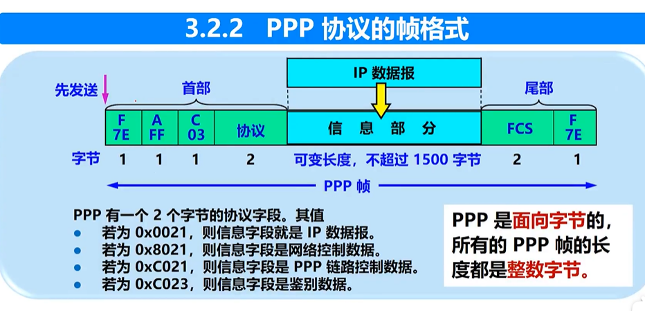

7. 适配器就是网卡，网卡和CPU并行通信，和局域网通过mac串行通信，适配器主要功能就是实现以太网协议，以太网就是局域网。

8. 以太网的两个标准啥？

   1. DXV1英特尔搞的，标准10MBs
   2. iEEE802委员会在1983年指定了第一个IEEE的以太网标准IEEE802

9. 物理层拓展以太网

   1. 集线器，虽然通信方便，但是碰撞更多，基本没人用了。带宽是B，用户是N，那每个人才B/N	

10. 数据链路层拓展以太网

    1. 早期是网桥
    2. 现在用以太网交换机，n台机器n个碰撞域。交换机的每个端口是带宽是B，有N个用户，那一共是N*B的总带宽

11. 以太网交换机的自学习功能

12. 整个发展历史

    1. 早期总线结构，使用CSMA/CD协议，半双工工作
    2. 交换机为中心的星型结构， 没有破协议、没有共享总线、没有碰撞问题，但是帧结构还是老样子，毕竟是链路层。

13. 以太网存在的问题

    1. 广播风暴：递归发送
    2. 安全问题：两个部门之间的通信就没法隔离，一广播全知道了
    3. 管理困难

    解决方案：vlan，其实就是逻辑区分（基于端口划分、基于网卡mac地址），而非物理区分，只给虚拟域内的计算机广播，这样即可以隔离，又改善了风暴的情况

    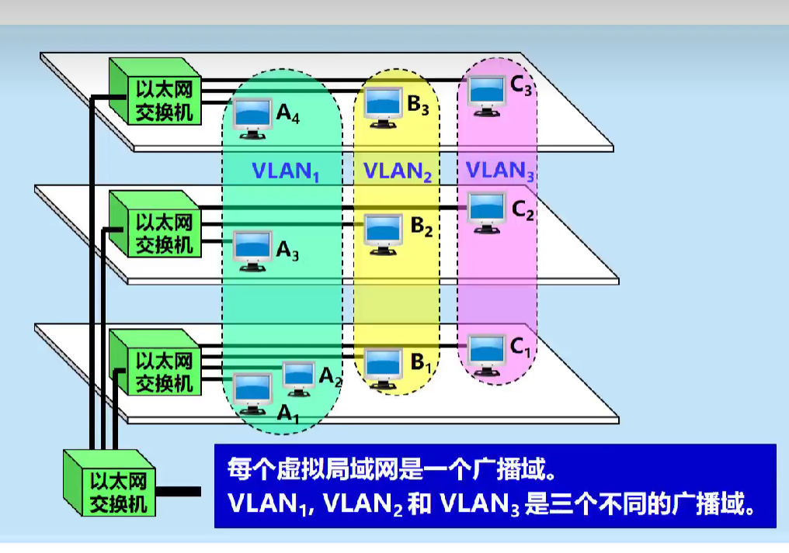

    ​	

#### 网络层

1. 基于数据报的服务，从不同路径出发，最后到了拼装，不保证可靠性，可靠性由运输层保证

   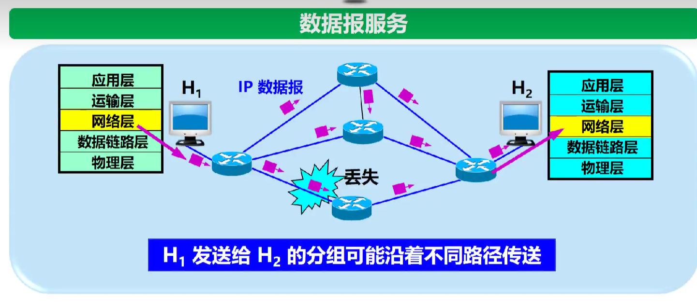

2. 不同网络中两个主机的之间的通信，要经过很多路由器，转发分组来执行，所以路由器之间传输的信息有两大类

   1. 数据：硬件来处理，路由器根据转发表，发就完事了
   2. 路由信息：软件来处理，根据路由协议用的算法计算路由，搞出路由表，计算下一跳

3. SDN！！！软件定义网络，远程服务器计算出正确的路由，大局观拉满

4. 市面上的路由器基本都要支持IPV4，各个网络都比较异构，需要统一协议

5. IP上面使用一下TCP，就是现在所谓的Internet，互联网就是多种异构网络组成的

6. IPv4配套3个子协议

   1. 地址解析协议 ARP address resolution protocol。IP to Mac

   2. 网际控制报文协议ICMP internet controll message protocol。用于故障管理、网络管理什么的，比如ping就是这个

   3. 网际组管理协议IGMP internet group managment protocol。管理组的，具体不太懂。

      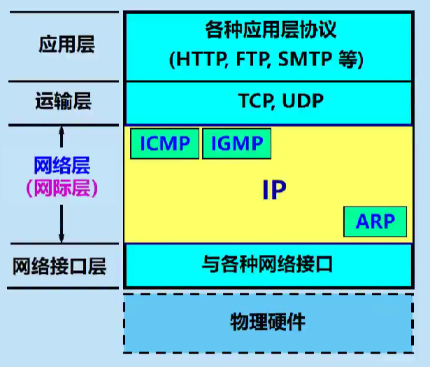 

7. IP地址分为网络号和主机号

8. CIDR消除了传统ABC类地址划分子网的概念，更加有效分配IPV4的地址空间，但无法解决IP枯竭的问题

9. 路由聚合，把16个地址合成1个，非常灵活

   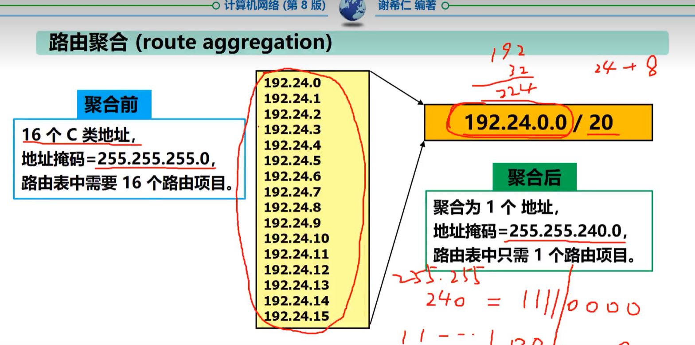 

10. 已知一个机器的ip，怎么知道他的mac地址？

    arp address resolution protocal，从ip地址解析出mac地址。arp请求是局域网内的，废话 

    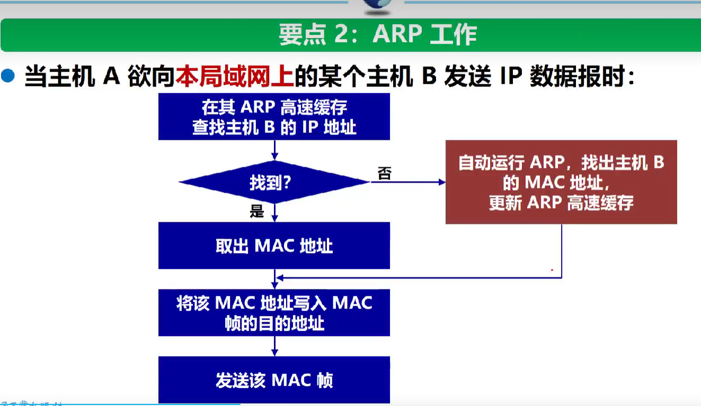 

11. RIP（route info protocol）缺点

    1. 网络规模有限，最大为15
    2. 交换的信息是完整路由表 ，开销较大
    3. 坏消息传播的很慢，收敛时间长

12. 内部网关协议OSPF（open shortest path first）当初是为了克服RIP的缺点研发出来的

    1. 原理简单的一笔，每隔一段时间，采用所谓的洪泛法，获得当前区域所有路由器相邻信息，等于获得了图的邻接表

    2. 优点：减少网络通讯量

    3. 缺点：交换信息种类变多，协议变复杂

13. RIP和OSPF都是域内路由选择，还有一个域外路由选择BGP(“border gateway protocol)，只要求算出一条比较好的路由，别死循环，不是要最佳

#### 运输层

1. tcp可靠传输

   1. 停止等待协议

      

   2. 连续ARQ协议

2. 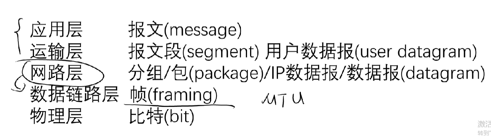 

# 大杂烩

1. **模拟信号是连续的，比如压力、音频等，数字信号是离散的**0101010，数字转模拟信号的过程叫调制

2. 帧 是数据链路层，包含开始和结束标记的一个连续的比特序列

3. 数据链路层的流量控制本质就是调节 控制网络内部相邻节点之间的数据链路上的流量

4. 数据链路层分为两个层

   1. LLC（逻辑连接控制）

   2. MAC

      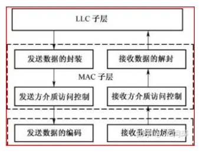  

5. 以太网用的标准的是总线型拓扑，但是加个交换器什么的，就可以搞成星星拓扑了，但是在逻辑上，以太网仍然是CSMA/CD 多重载波碰撞技术

6. 在OSI模型中 每层的活动元素是**实体**，可以是软件，也可以是硬件

7. 局域网参考模型IEEE802有几层？

   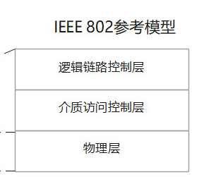 

8. 在OSI模型中，有四种基本的原语（primitive），用于实现各个层之间的通信。这些原语是：

   1. 请求（Request）：请求原语用于向较低层发送请求以执行某个操作。例如，在传输层向网络层发送请求以发送数据包。
   2. 指示（Indication）：指示原语用于通知较高层已经发生了某个事件或接收到了某个数据。例如，在网络层向传输层发送指示以通知数据包的到达。
   3. 响应（Response）：响应原语用于对较低层的请求作出响应。例如，在网络层对传输层的请求进行响应，以便传输层可以继续发送数据。
   4. 确认（Confirmation）：确认原语用于向较高层发送确认信息，以便通知操作已成功完成。例如，在传输层向网络层发送确认以确认数据包的成功传输。

9. 网络协议的三要素包括**语法、语义和时序**。

   1. 语法指的是数据格式和传送方式，以及数据出现的顺序
   2. 语义指的是数据所表示的意义
   3. 时序：详细说明了数据顺序，也叫同步

10. HDLC高级数据链路，帧有三种 信息、无编号、监控，死记硬背就行

11. 令牌环发就是有一个令牌，令牌就是特殊的帧，分为空和忙两个状态，要是想发数据，必须等到空令牌，然后把它标记成忙，绕一圈，回到原地，再标记成空，让出去。另外，令牌是IEEE802.5定义规范。

12. 10BASE-5和10BASE-2都是一种以太网标准

    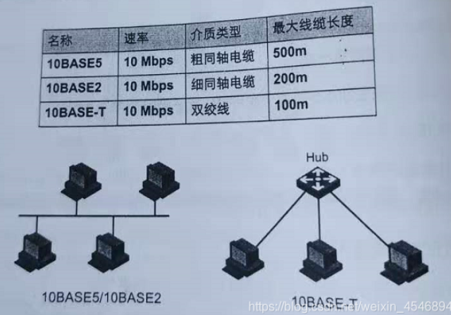 

13. com域名是商业组织，商业的缩写。www表示是http协议。

14. ABC类分别net-id长度是8 16 24，好记。

15. 路由选择算法动态的有两种

    1. 距离矢量：主要就是RIP
    2. 链路状态：OSPF

16. 通用的调制技术里面，脉冲数字调制技术是  把模拟数据抓换成数字信号

17. 基于IEEE802.3的局域网拓扑结构 总线型

18. 基于IEEEE802.3的总线局域网介质访问控制协议采用CSMA/CD

19. IEEE802为局域网的标准只针对物理层和数据链路层

20. 双绞线胶合的目的是减少干扰

21. 数据交换的方式

    1. 电路交换：电路交换指用户之间需要数据传送时，交换中心在两者间起到桥接作用。当电路连接后两个用户都可以传输数据，且一直占用到传输完成。电路交换引入的延迟非常小，而且交换机不处理数据，因此适合实时和大批量数据的传输。
    2. 报文交换：报文交换通常是用电脑完成。发送方首先将要发送的数据编译成报文信息，并将其与诸如接收地址等辅助数据一起发送到本地交换中心，本地交换中心将完整地存储这些信息并进行适当地处理。当本地交换中心的出口空闲时，消息将被转发到下一个交换中心，最后由接收方交换中心将消息传递给用户。**报文需要大量磁盘空间，不需要建立连接**
    3. 分组交换：分组交换通常是把数据（数据信息和控制信息）拆分成若干个分组在交换机中进行交换，这些分组的传输路径并不完全相同。分组交换时会对数据进行错误检查、重发等。最后，接收端将接收到的所有分组数据重新组合即完成分组交换。
    4. 混合交换：混合交换是指同时采用了电路、分组两种方式的交换。混合交换将传输通道划分为不同的带宽，并将这些带宽分别分配给电路交换与分组交换使用。带宽是指允许在传输通道上传输信息的频带宽度，也就是指信道能够承接信号源的最高频率。

22. 网络协议是计算机网络通信的**对等层实体**交换信息的约定，简单说两台主机，网络层和网络层，传输层和传输层

23. 网络接口层对应了物理层和数据链路层，网络互联层才是网络层，这是TCP/IP四个层次

24. 传输单位纠正一下：数据链路是帧，没问题。网络层是分组或者叫包。传输层叫报文或者段。

    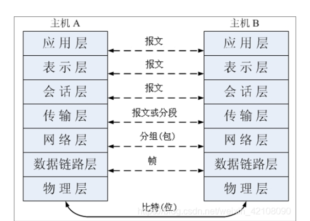 

25. 计算机网络按功能划分可以分为通信子网和资源子网

26. 数据链路层的功能是通过必要的同步控制、差错控制、流量控制，为网络层提供可靠、无错误的数据信息

27. 工作在数据路层的设备是 网桥/交换机

28. 局域网上信道传输的信号有

    1. 基代：直接穿比特
    2. 宽带：把基代调制到不同频段

29. 传输媒体对比

    1. 双绞线（Twisted Pair）：
       - 传输介质：由一对绝缘的铜线组成，通过将两根线缠绕在一起来减小电磁干扰。
       - 传输速度和带宽：传输速度较低，一般用于较低速率的数据传输，如传输电话信号和局域网（LAN）数据。
       - 距离：在100米以内效果良好。
       - 抗干扰性：相对较差，容易受到电磁干扰的影响。
    2. 同轴电缆（Coaxial Cable）：
       - 传输介质：由一个中心导体、一个绝缘层、一个屏蔽层和一个外部导体组成，中心导体和外部导体之间通过绝缘层隔离。
       - 传输速度和带宽：传输速度较高，可支持较大带宽，适用于广播电视、有线电视和局域网等应用。
       - 距离：可以传输的距离较长，一般可达几百米。
       - 抗干扰性：相对较好，由于屏蔽层的存在，能够减少外部电磁干扰的影响。
    3. 光纤（Fiber Optic）：
       - 传输介质：使用光信号在光纤内传输，通常由一个玻璃纤维或塑料纤维组成。
       - 传输速度和带宽：传输速度非常高，可支持极大带宽，适用于高速数据传输和长距离通信。
       - 距离：可以传输的距离非常远，数十到数百公里不等。
       - 抗干扰性：光纤具有很强的抗干扰能力，不易受电磁干扰的影响。

30. IP有三个部分哦，不止网络号主机号，还有一个网络类别，ABC那个

31. 拓扑结构有：总线、星型、树形、环形、网状

32. A类网络的IP地址范围为：1.0.0.1－126.255.255.254；
    B类网络的IP地址范围为：128.1.0.1－191.255.255.254；
    C类网络的IP地址范围为：192.0.1.1－223.255.255.254

    看到192后面的，都秒杀为C类

33. ##### 端口号和套接字是什么？说一个常见端口号

    TCP链接的端点是套接字，每一条TCP连接由两个套接字组成，套接字为IP+端口号的组合，端口号作用是标记一台计算机中特定的进程。

34. ##### 简单说一下距离矢量路由算法

    XXX是一种基于路由上的距离信息进行决策的算法，每个路由器都维护一张距离表，用户计算到达目的地的最短距离。

    具体来说，每个节点接受来自相邻节点的路由表信息进行计算；

    把计算完的结果返回给相邻节点。

    计算循环进行，直到相邻节点没有可交换信息为准。

35. ##### 简述交换机的工作原理

    交换机工作在数据链路层，接受的传递的单位是帧。以太网交换机有一个交换表，当初始接受到从A发往B的帧的时候

    1. 从帧中解析出来源和目的地的物理地址，也就是mac地址
    2. 和系统内部的查找表进行比较，如果表中没有，把mac地址和接口记录到表中，同时向所有非该接口的接口发送广播
    3. 目的主机以外的所有主机丢弃这个广播信息，目的主机接受，返回消息到交换机，交换机把B的地址和端口记录下来

36. ##### 简述一下IP寻路过程

    1. 先确定一下是本地网络还是远程网络
       1. 如果是本地网络，那么通过数据链路层的物理地址去解决，无需路由器转发
       2. 如果是远程网络
          1. 查询路由表，如果存在目的IP，那么根据当前路由表选择最佳寻路算法来确定下一条的目的地，可以是距离矢量算法，比如RIP，也可以是链路状态算法，比如OSPF
          2. 如果不存在目的IP，那么发送至缺省的路由器，依次递归处理，直至转发上限

       3. 在处理过程中，可能路由器会缺少匹配项、路由器损坏、目标网络不存在等等，导致目标IP找不到。那么通常，源主机会一定次数的重传，再确认是否真的失败

37. ##### 简述一下CSMA/CD原理

    CSMA/CD是早期数据链路层的介质访问协议，他有几个特点

    1. 载波监听，发送数据之前，判断总线上是否有数据传输，如果有，那就等待
    2. 多路访问，如果没有，那就可以发送了。多个设备可以共用一个线路
    3. 冲突检测，避免多个设备同时发送
    4. 退避算法，如果检测到冲突，那么会随机选择一个等待时间，避免冲突累积过多

    但是后面，以太网交换机逐渐取代了这种方法，交换机作为一个星星结构，是全双工协议，而CSMACD还是半双工

38. ##### 网络层主要解决的问题

    1. 路由选择
    2. 拥塞控制：提一下，主要还是传输层去做，网络层也可以通过路由去缓冲区管理，或者ICMP ping命令去提示上层网络拥堵情况
    3. 通过IP地址，来实现网络互联

39. ##### TCP和UDP区别说一下

    1. 连接无连接
    2. 可靠不可靠
    3. TCP面向字节流，UDP面向报文的
    4. TCP有拥塞控制，UDP没有，因此网络拥堵不会让主机发送频率降低，比如视频
    5. TCP是1v1，UDP都可以

40. ##### TCP和IP中，举两个网络互连层的例子

    1. IP：主要功能是把传输层的数据信息进行分组，根据指定算法选择要转发的路由
    2. ICMP：差错检验协议，可以检查出最基本的错误，也能给出一点出错原因，常见的用于判断网络是否连通的ping命令也是基于该协议

41. ##### 数据链路层的主要工作

    1. 将比特流封装成帧
    2. 差错控制，例如ARQ协议可以确认发送方是否收到
    3. 流量控制，例如通过滑动窗口
    4. MAC寻址

42. ##### DNS

    1. 浏览器先找自己的缓存
    2. 浏览器如果没有，会从host文件里找记录
    3. host文件没有，就从路由器中找
    4. 路由器也没有，去ISP运营商查
    5. 找根域名服务器，com、edu那些都是顶级域名服务器的，返回顶级域名服务器的ip
    6. 顶级域名服务器会告诉你，com的权威域名服务器是xxx
    7. 权威里找

43. ##### FTP说一下

    1. FTP有两个端口，20是数据传输，21是控制传输
    2. 先创建21 一条控制连接，除非主动关闭，不然一直都在
    3. 然后用20传播数据

    用到的协议：

    1. 局域网内的话，要用ARP协议，转MAC地址
    2. 不同网络之间，要用IP协议，分组转发
    3. TCP协议，保证可靠传输
    4. ICMP作为故障检测

44. 三层交换机一般是局域网的核心，记住就行…

    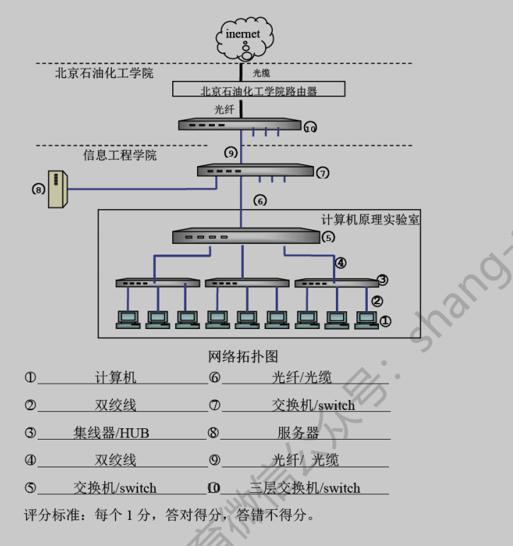 

45. TCP IP体系说一下

    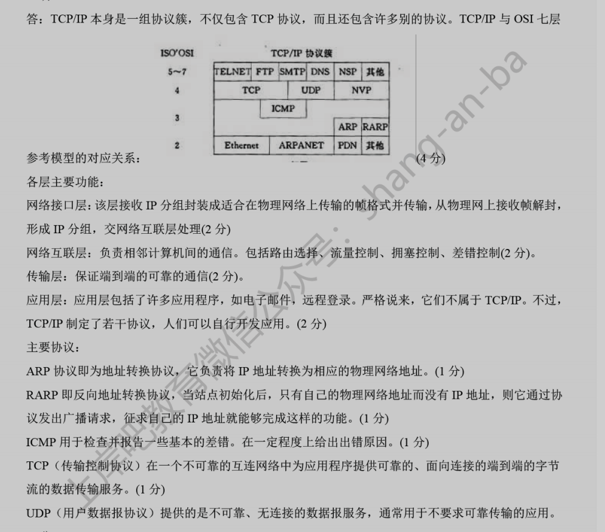 

46. 核心交换机和汇聚交换机、接入层交换机

    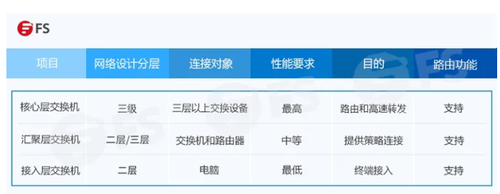 

    首先确认路由器是网络层，处理IP。交换机是数据链路层的，处理mac。

    交换机转发效率很高，而路由器依靠CPU计算后才能进行IP转发，因为有算法，而且路由器成本高。

    所以核心交换机就是带路由功能的交换机。

    核心交换机主要是承载一个园区里的VLAN。

    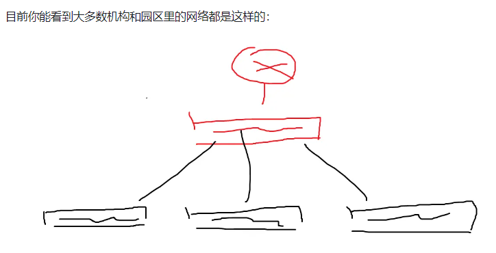 

    也就是说终端通过接入交换机，汇聚到核心交换机上。

    所有园区内部的网络只通过核心交换机转发，只有跨网段的请求才会动用路由器！

    对于一个机构来说，日常局域网内部的数据交换量是很大的！要比路由器处理的工作量大！

    当然，核心交换机也会有一个ARP表。

    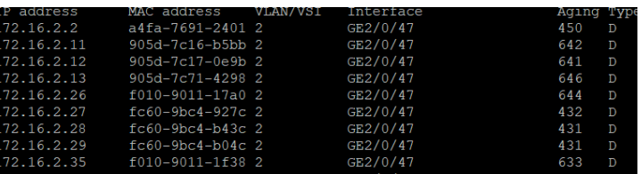 

47. 网络性能指标

    1. 速率：一秒多少比特
    2. 带宽：最高速率，比如600Mb/s，真实其实是75MB/s = 75M/s
    3. 吞吐量：实际的速率
    4. 时延：当传输的数据量远远大于路径时，发送时延占主导因素。当路径远远大于传输的数据量时，传播时延占主导因素（如从地球向太空发送数据
    5. 往返时间：即从源主机发送信号到目标主机，目标主机接收信号再返回到源主机所需要时间。（一个来回）
    6. 丢包率：分组丢失率。例如ICMP就会检测。

